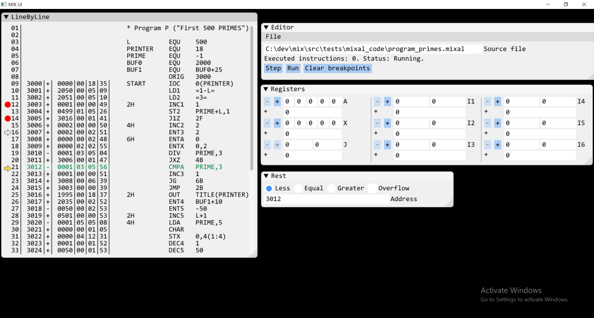

# MIX

[](https://ci.appveyor.com/project/grishavanika/mix)
[](https://travis-ci.org/grishavanika/mix)

- [MIX UI (debugger) progress](#mix-ui-debugger-progress)
- [Translating "FIRST FIVE HUNDRED PRIMES"](#translating-first-five-hundred-primes)
- [Executing "FIRST FIVE HUNDRED PRIMES"](#executing-first-five-hundred-primes)
- [Integration with GNU MIX Development Kit (MDK)](#integration-with-gnu-mix-development-kit-mdk)
- [Building](#building)
- [Dependencies](#dependencies)
- [mixal command-line help](#mixal-command-line-help)
- [TODO](#todo)

##### MIX UI (debugger) progress



##### Translating "FIRST FIVE HUNDRED PRIMES"

```
mixal --hide-details --interactive --file src/tests/mixal_code/program_primes.mixal
```

```
3000: |+| 0000|00|18|35|
3003: |+| 0001|00|00|49|
3004: |+| 0499|01|05|26|
3006: |+| 0002|00|00|50|
3007: |+| 0002|00|02|51|
3008: |+| 0000|00|02|48|
3009: |+| 0000|02|02|55|
3010: |-| 0001|03|05|04|
3011: |+| 3006|00|01|47|
3012: |-| 0001|03|05|56|
3013: |+| 0001|00|00|51|
3014: |+| 3008|00|06|39|
3015: |+| 3003|00|00|39|
3005: |+| 3016|00|01|41|
3017: |+| 2035|00|02|52|
3018: |-| 0050|00|02|53|
3019: |+| 0501|00|00|53|
3020: |-| 0001|05|05|08|
3021: |+| 0000|00|01|05|
3022: |+| 0000|04|12|31|
3023: |+| 0001|00|01|52|
3024: |+| 0050|00|01|53|
3025: |+| 3020|00|02|45|
3026: |+| 0000|04|18|37|
3027: |+| 0024|04|05|12|
3028: |+| 3019|00|00|45|
3029: |+| 0000|00|02|05|
   0: |+|             2|
3016: |+| 1995|00|18|37|
1995: |+|06|09|19|22|23|
1996: |+|00|06|09|25|05|
1997: |+|00|08|24|15|04|
1998: |+|19|05|04|00|17|
1999: |+|19|09|14|05|22|
2024: |+|          2035|
2049: |+|          2010|
3001: |+| 2050|00|05|09|
3002: |+| 2051|00|05|10|
2050: |-|           499|
2051: |+|             3|
```

##### Executing "FIRST FIVE HUNDRED PRIMES"

```
mixal --file src/tests/mixal_code/program_primes.mixal
```


##### Integration with GNU MIX Development Kit (MDK)

There is much more powerful project, called "[MDK]" that can be viewed as IDE for MIX
(no support for Windows).

Now, you can compile MIXAL code into MIX byte-code using MDK compiler
and then execute compiled program using interpreter from this project.

Here is how:

```
# Compile MIXAL code on Linux, using MDK
mixasm program_primes.mixal
# or the same, but without debug symbols
mixasm --ndebug program_primes.mixal
# (this will output compiled code in program_primes.mix file)
# now, execute it, using interpreter
#
mixal.exe --execute --mdk --file program_primes.mix
```

[MDK]: https://www.gnu.org/software/mdk/

##### Building

|         Name        | Version | Actual compiler |    Version    |        CMake command                      |
|-------------------- |---------|-----------------|---------------|-------------------------------------------|
| Visual Studio 2019  | 16.2.3  |     cl.exe      | 19.22.27905   | -G "Visual Studio 16 2019" -A x64         |
| Clang (VS 2019)     | 16.2.3  |   clang-cl.exe  | 8.0.0         | -G "Visual Studio 16 2019" -A x64 -T LLVM |
| GCC (STL/nuwen.net) | 7.3.0   |   gcc.exe       | 7.3.0         | -G "Unix Makefiles"                       |
| GCC (WSL)           | 7.3.0   |   gcc           | 7.3.0         | -G "Unix Makefiles"                       |

Third-party dependencies will be downloaded and compiled during the build 
if they are missing.  

I.e, you can install them to speed-up usual edit/compile/run cycle using Vcpkg:

```
vcpkg install gl3w
vcpkg install sdl2
vcpkg install gtest
```

[Vcpkg]: https://github.com/microsoft/vcpkg

Examples:

```
:: Usual MSVC/x64
cmake -G "Visual Studio 16 2019" ^
  -DCMAKE_INSTALL_PREFIX=install ^
  -A x64 ^
  ..
:: Clang on Windows/x64
cmake -G "Visual Studio 16 2019" ^
  -A x64 ^
  -T LLVM ^
  ..
:: MSVC/x64 with Vcpkg dependencies
:: (Vcpkg installed to C:/libs/vcpkg)
cmake -G "Visual Studio 16 2019" ^
  -A x64 ^
  -DCMAKE_TOOLCHAIN_FILE=C:/libs/vcpkg/scripts/buildsystems/vcpkg.cmake ^
  ..
:: MinGW with custom install folder, Release configuration
:: (MinGW installed to C:\Programs\mingw_gcc_7.3.0)
set path=%path%;C:\Programs\mingw_gcc_7.3.0\bin
cmake -G "Unix Makefiles" ^
  -DCMAKE_BUILD_TYPE=Release ^
  -DCMAKE_INSTALL_PREFIX=install ^
  ..
```

To build use either generated .sln file or CMake:

```
cmake --build . --config Release
:: ... and additionally install all targets
cmake --build . --config Release --target install
```

###### Dependencies

Core stuff (MIX VM, interpreter, parser, assembler) have no dependencies.  
Other things (tools, UI, tests) dependencies listed in third_party/ folder:

* (for command line tools) cxxopts: https://github.com/jarro2783/cxxopts.git
* (for, obviously, tests)  gtest  : https://github.com/google/googletest.git
* (for debugger UI)        imgui  : https://github.com/ocornut/imgui.git
* (for imgui)              gl3w   : https://github.com/skaslev/gl3w.git
* (for imgui)              sdl2   : https://github.com/SDL-mirror/SDL.git
* (for imgui, implicitly)  opengl

###### mixal command-line help

```
MIX interpreter/emulator/compilator
Usage:
  mixal [OPTION...]

  -h, --help          Show this help and exit
  -e, --execute       Compile and execute file with MIXAL code
  -i, --interactive   Compile MIXAL code line by line and print formatted MIX
                      byte-code
  -x, --hide-details  Hide additional information during interactive compile
  -f, --file arg      Input file (either MIXAL code or MIX byte-code)
  -m, --mdk           Interpret <file> as file with GNU MIX Development Kit
                      (MDK) format
```

###### TODO

* write debugger/UI, see MDK for reference
* fix static/shared libraries build (with & without Vcpkg):
  ```
  cmake -G "Visual Studio 16 2019" ^
    -DBUILD_SHARED_LIBS=ON ^
    -DCMAKE_WINDOWS_EXPORT_ALL_SYMBOLS=ON ..
  ```
  `CMAKE_WINDOWS_EXPORT_ALL_SYMBOLS` should not be there (?)
* use Rx & ImGui to build debugger UI
* add index register influence to LD/ST/ADD/SUB and similar tests: `LDA 2000,3(1:3)`
* add Travis CI build support for **Clang**
* port everything to WASM (Emscripten)
* clean-up CMake scripts
